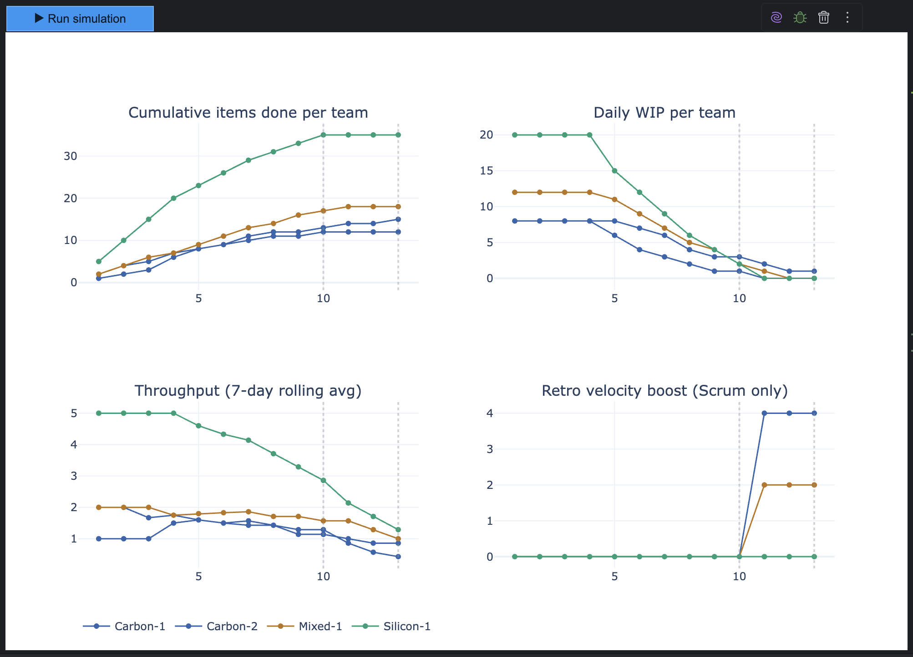

# Agile Team Simulator 
A toy simulation for exploring how team composition, WIP limits, and methodology affect throughput. 
Built as a learning experiment: not a rigorous model, but hopefully a useful thinking tool.

## What it does

Simulates a software delivery backlog being worked on by three kinds of teams:

- **Carbon teams**: humans. Good at ambiguity, benefit from retrospectives, degrade when overloaded.
- **Silicon teams**: AI agents. Fast, flat efficiency curve, no ceremony overhead, hit a hard ceiling instead of degrading gracefully.
- **Mixed teams**: humans and agents working together. Get a small synergy bonus neither type gets alone.

You can run them under **Scrum** (sprints, ceremonies, retro velocity boost) 
or **Kanban** (continuous flow, WIP limits, no ceremony overhead) and sweep across WIP limit values to find where each team type peaks.

## Key finding

The WIP limit that maximises throughput is very different per team type:
roughly **7–8 for Carbon**, **15–18 for Silicon**. 
Applying the same WIP limit to both, which is what most teams do by default, 
either throttles your agents or overloads your humans.

## Model assumptions (and where they're **still** wobbly)

- Carbon efficiency follows a bell curve peaking at ~1.5× team size in WIP. This is loosely inspired by flow theory and context-switching research, but the specific numbers are made up.
- Silicon parallelism benefit ramps up to a ceiling modelled as 4× team size. The ceiling represents rate limits and compute constraints, not cognitive load.
- The retrospective boost is a compounding additive multiplier, capped at +30% for Carbon. Completely made up, but directionally defensible.
- Backlog items have randomised complexity drawn from uniform distributions. Real backlogs are messier.
- There are no dependencies between items, no blocked states, no team communication overhead beyond the ceremony fractions.

## What this is
- NOT a production planning tool. 
- NOT a substitute for your actual metrics. 
- NOT a reason to fire your humans or decommission your agents.
---

## Setup

Open a terminal and verify Python is available with `python --version`. You want 3.10 or higher.

To set up the simulation, follow these steps:
1. Clone the repository: `git clone https://github.com/VXCompany/agile-simulator.git`
2. Navigate to the project directory: `cd agile-simulator`
3. Install dependencies: `pip install -r requirements.txt`
4. Run the simulation: `jupyter notebook carbon-vs-silicon.ipynb`

*Built during a VX Company AI Lab experiment. Inspired by the Kanban game (https://getkanban.com/) and _a few_ conversations about optimal team composition.*

